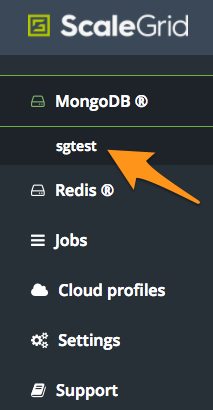
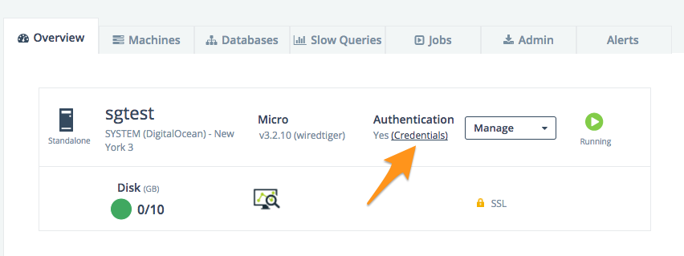
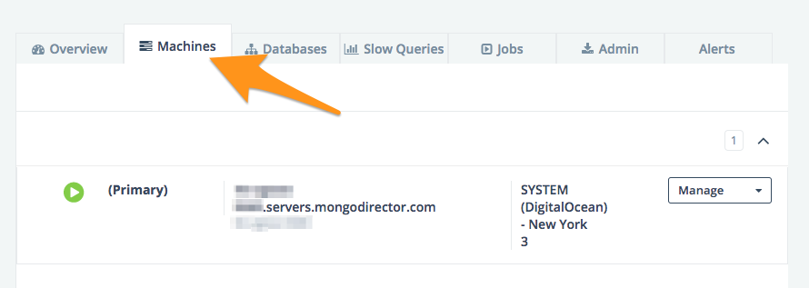
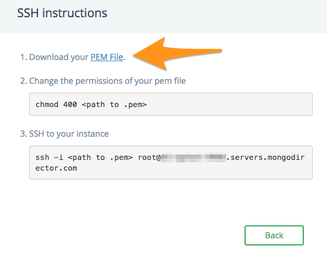
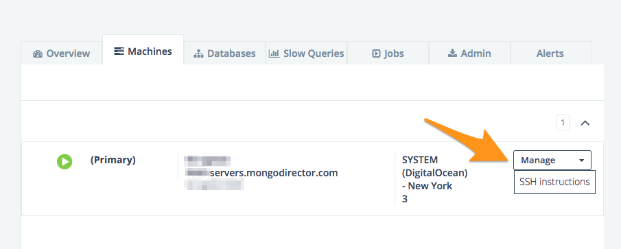

.. figure:: images/white-logo.png
   :alt: SlamData Logo

.. raw:: html

    <embed>
    <script>
      !function(){var analytics=window.analytics=window.analytics||[];if(!analytics.initialize)if(analytics.invoked)window.console&&console.error&&console.error("Segment snippet included twice.");else{analytics.invoked=!0;analytics.methods=["trackSubmit","trackClick","trackLink","trackForm","pageview","identify","reset","group","track","ready","alias","debug","page","once","off","on"];analytics.factory=function(t){return function(){var e=Array.prototype.slice.call(arguments);e.unshift(t);analytics.push(e);return analytics}};for(var t=0;t<analytics.methods.length;t++){var e=analytics.methods[t];analytics[e]=analytics.factory(e)}analytics.load=function(t){var e=document.createElement("script");e.type="text/javascript";e.async=!0;e.src=("https:"===document.location.protocol?"https://":"http://")+"cdn.segment.com/analytics.js/v1/"+t+"/analytics.min.js";var n=document.getElementsByTagName("script")[0];n.parentNode.insertBefore(e,n)};analytics.SNIPPET_VERSION="4.0.0";
      analytics.load("ZVWTrB6ijnF00L6ZENqtGzMCjfIauXvo");
      analytics.page();
      }}();
    </script>
    </embed>

Administrator's Guide
=====================

This Administrator's Guide describes how to install and configure SlamData.

For basic information on how to use SlamData please refer to the
`SlamData User's Guide <users-guide.html>`__.

For further information on how to use SlamData and instructions on how to
integrate SlamData into other applications please refer to the
`SlamData Developer's Guide <developers-guide.html>`__.

Section 1 - Installation
------------------------


1.1 Minimum System Requirements
~~~~~~~~~~~~~~~~~~~~~~~~~~~~~~~

  * Minimum memory
      * 2 GB memory
      * An additional 25 MB is required for each active user
  * Disk
      * 300 MB for a basic installation
      * Additional space varies based upon Workspace size, cached queries, and so on
  * Java
      * Java 1.8
      * Windows and Mac OS versions of SlamData with installers include Java
      * Linux requires a separate Java installation
  * Browsers
      * The most compatible browsers with SlamData are always the most recent versions of Google Chrome and Mozilla Firefox
      * Microsoft Edge and Safari are both limited in functionality and some UI elements, such as Date picker, do not render properly, or at all
  * Target data sources (for analytics)
      * Apache Spark 2.1 and above
      * Couchbase 4.5.1 and above
      * MarkLogic 8 and above
      * MongoDB 2.6 and above


1.2 Obtaining SlamData
~~~~~~~~~~~~~~~~~~~~~~

1.2.1 Obtaining a license
'''''''''''''''''''''''''
You will need a license to use SlamData Advanced. If you do not have a license
or SlamData.com account please visit https://slamdata.com/30-day-trial/
to obtain a trial license, https://slamdata.com/slamdata-jump-start/ to
purchase a trial with additional training and support or
https://slamdata.com/contact-us/ to get a quote for your SlamData Advanced
License.

If you have lost your license key please visit
https://slamdata.com/my-account/.

Updating your license information can be achieved by reinstalling.

1.2.2 Obtaining SlamData Advanced
'''''''''''''''''''''''''''''''''
There are two ways of using SlamData Advanced. If you want to try SlamData on
your PC or Mac we recommend using the SlamData Advanced Launcher. If you want to
use SlamData on your server(s) we recommend using the SlamData Advanced Jar.

1.2.3 SlamData Advanced Launcher
''''''''''''''''''''''''''''''''
The SlamData Advanced Launcher is available for macOS, Windows and Linux.
On Windows the SlamData Advanced Launcher allows you to launch SlamData Advanced
from your Start Menu. On macOS the SlamData Advanced Launcher allows you to
launch SlamData from your Applications folder or Launchpad.

To get started visit https://slamdata.com/downloads/ and download the SlamData
Advanced Installer, launch the installer and follow the instructions.

You will need to provide a license key or trial license key during installation.
If you have lost your license key please visit
https://slamdata.com/my-account/.

Updating your license information can be achieved by reinstalling.

1.2.3.1 SlamData Advanced Launcher Default Authentication
``````````````````````````````````````````````````````````
By default the SlamData Advanced Launcher is configured to authenticate with
SlamData.com. You will need a SlamData.com account and access to the internet
to use the SlamData Advanced Launcher in its default configuration. 

If you signed up for a trial License at https://slamdata.com/30-day-trial/
your SlamData.com account details are the username and password you provided.

1.2.4 SlamData Advanced Jar
'''''''''''''''''''''''''''
To get started visit https://slamdata.com/downloads/ and download the SlamData
Advanced Jar Archive.

Next unzip the archive and navigate to the SlamData directory using the
following commands.

.. code-block: bash

    tar jxf slamdata-advanced.tar.bz2
    cd slamdata

Next save the following configuration file as ``config.json``.

.. code-bock:: json

    {
      "server": {
        "port": 20223
      },
      "authentication": {
        "openid_providers": [
          {
            "client_id": "RFQmEeS0Vw8UWUchQio5tQczsKIqpL",
            "display_name": "SlamData",
            "openid_configuration": {
              "issuer": "https://slamdata.com",
              "authorization_endpoint": "https://slamdata.com/oauth/authorize",
              "token_endpoint": "https://slamdata.com/oauth/token",
              "userinfo_endpoint": "https://slamdata.com/oauth/me",
              "jwks": [
                {
                  "kty": "RSA",
                  "alg": "RS256",
                  "use": "sig",
                  "n": "seduM0gTPqJWT57IFe0_QokLM-fTuhp3lF8zD7AoOyP6yVsNJeEUf91YeuGxOIa3AZRQRX4SaiGfrv57JA8HEHLOIXBx680QjYGAu9urKBFoeNNrWxAVy65CxbnM4pTnzzGBHQhVCaIHhj7nfvcULmE5IV1Xqc3-VKDajVZD0E-_1QQO9XKDix9V1cmc5k6Ejx97tccMLhqYi6vhjg1cgSGeNpM-40K6WL3Y7q1pmEEPLkEkCCNJoEg7D5Xjxfi9a5xaUHRhVo8lpiKi5m9-7ujaN4SzCqoYy1wJT9agPzCaeWNT0tUYuo9ZCH_ev7NxYzzXTS08NXo_BBXypZ40Iw",
                  "e": "AQAB"
                }
              ]
            }
          }
        ]
      }
    }

If you would like SlamData to use a different port, additional or different
authentication providers, different storage for metadata or enable auditing or
HTTPS please edit the above configuration file using `Section 3 - Configuring
SlamData`_ as a reference.

Finally start SlamData Advanced using the following command.

Please replace the details in the arguments starting with -D with your license
information.

Please replace the numbers in the arguments starting with -X with the number of
GB of memory you would like to allocate to SlamData.

.. code-block:: bash

    java -Xms2G -Xmx2G -Dlicense_key=ABCDE-12345-ABCDE-12345-ABCDE -Dlicense_email=myemail@example.com -Dlicense_full_name="My Name" -Dlicense_registered_to="Name Registered To" -Dlicense_company="My Company Name" -Dlicense_street="123 Anywhere Street, Suite A1" -Dlicense_tel_number=3035551212 -Dlicense_fax_number=NA -Dlicense_city=Boulder -Dlicense_zip=80302 -Dlicense_country=US -jar quasar.jar --content-path public --config config.json


Section 2 - Connecting to a Data Source
---------------------------------------

Connecting to a data source is the first step to analyzing data.


2.1 Data Sources
~~~~~~~~~~~~~~~~

Supported data sources are listed in the following sections.  As new
target data sources are released, they will be listed below.

To connect to data source click on the Mount |Mount-Icon| icon in the upper
right.

A mount dialog will be presented, as shown below.

.. figure:: images/SD4/screenshots/mount-dialog-start.png
   :alt: SlamData Mount Dialog

Enter a name for the data source mount. This name is used in the SlamData
User Interface (UI) as well as SQL² query paths.

.. hint:: **Mount Name**

  Use a name that makes sense for the environment. For example,
  if a data source were hosted on Amazon AWS/EC2 it might be named
  ``aws`` or ``aws-1``.

Click the **Mount** button to mount the database in SlamData.


2.2 Mount Options
~~~~~~~~~~~~~~~~~

The mount dialog will display the appropriate fields based upon the mount
type selected. For each data source that SlamData supports, a section
below describes the options available.

2.2.1 MongoDB
'''''''''''''

Select **MongoDB** as the mount type. Once the mount type has been selected,
additional fields will appear in the dialog.

The following table shows an example MongoDB server running on localhost
with connection available on port 27017. No authentication is required in this
case.

+----------------+-----------+
| Parameter      | Value     |
+================+===========+
| Host           | localhost |
+----------------+-----------+
| Port           |  27017    |
+----------------+-----------+
| Username       |           |
+----------------+-----------+
| Password       |           |
+----------------+-----------+
| Database       |           |
+----------------+-----------+
| Other Settings |           |
+----------------+-----------+

.. note:: **Using Authentication**

  When using MongoDB, the database field value should be the
  database the username and password will authenticate against. This value
  will depend on which database the user was created in. For example,
  it could be ``admin``, the name of the user or something completely different.

The MongoDB values listed in the Connection Options on the MongoDB
web site are supported. As of MongoDB 2.6 these options are as follows.

+------------------+---------+--------------------------------------------------------------------+
| Options          | Example | Description                                                        |
+==================+=========+====================================================================+
| ssl              | true    | Enable SSL encryption.                                             |
+------------------+---------+--------------------------------------------------------------------+
| connectTimeoutMS | 15000   | The time in milliseconds to attempt a connection before timing out.|
+------------------+---------+--------------------------------------------------------------------+
| socketTimeoutMS  | 10000   | The time in milliseconds to attempt a send or receive on a socket  |
|                  |         | before the attempt times out.                                      |
+------------------+---------+--------------------------------------------------------------------+

.. warning:: **MongoDB Limitations**

    MongoDB has several limitations which SlamData must work with and around
    noted below.

* Users are not allowed to write to secondary nodes in a replica set.
* Queries that return large result sets or use the ``mapreduce`` and ``aggregate``
  functions must use temporary workspace to store their results.

Because of these limitations users have a few options:

1. Connect to the MongoDB primary in a replica set with a user having
   read and write privileges.
2. Create a standalone MongoDB server which
   `Tails the Oplog <https://docs.mongodb.com/manual/core/tailable-cursors/#tailable-cursors>`__
   of a member of an existing replica set.


2.2.2 Couchbase
'''''''''''''''

Select **Couchbase** as the mount type. Once the mount type has been selected,
additional fields will appear in the dialog.

The following table shows an example Couchbase server running on localhost
with connection available on port 8091.

+----------------+---------------+
| Parameter      | Value         |
+================+===============+
| Host           | localhost     |
+----------------+---------------+
| Port           |  8091         |
+----------------+---------------+
| Username       | Administrator |
+----------------+---------------+
| Password       | \*\*\*\*\*\*  |
+----------------+---------------+

.. note::

  To use SlamData with Couchbase, a Username and Password will be required.
  In the example table above, the Administrator account and password are
  used. The Administrator account is created when Couchbase is installed.

.. hint:: **Memory Optimized Indexes**

  In the initial configuration of Couchbase, when it is being installed,
  memory optimized indexes should be enabled.

If the Couchbase default bucket is used with SlamData, it is necessary to
create a primary index as well as an index on the ``type`` field. For example:

.. code-block:: sql

    CREATE PRIMARY INDEX ON default;
    CREATE INDEX default_type_idx ON `default`(type);


2.2.3 MarkLogic
'''''''''''''''

Select **MarkLogic** as the mount type. Once the mount type has been selected,
additional fields will appear in the dialog.

The following table shows an example MarkLogic server running on localhost
with connection available on port 8000.

+----------------+---------------+
| Parameter      | Value         |
+================+===============+
| Host           | localhost     |
+----------------+---------------+
| Port           |  8000         |
+----------------+---------------+
| Username       | Administrator |
+----------------+---------------+
| Password       | \*\*\*\*\*\*  |
+----------------+---------------+
| Database       | /Documents    |
+----------------+---------------+

.. note::

  To use SlamData with MarkLogic, a Username and Password will be required.
  In the example table above, the Administrator account and password are
  used. The Administrator account is created when MarkLogic is installed.

.. hint:: **Directories**

  MarkLogic must contain one or more directories in the database before documents will be displayed.
  Additionally, documents must be located within a directory.


2.3 Several Mounts
~~~~~~~~~~~~~~~~~~

After mounting several data sources, the SlamData UI might look like the
following image. In this image, there are two separate mounts named
``aws`` and ``macbook``, the latter representing a
locally mounted data source.

.. figure:: images/SD4/screenshots/mount-all-mounts.png
   :alt: SlamData Multiple Mounts


2.4 SQL² View
~~~~~~~~~~~~~

SQL² Views are covered in detail in the `SlamData Developer's Guide <developers-guide.html>`__.


2.5 Enabling SSL for MongoDB
~~~~~~~~~~~~~~~~~~~~~~~~~~~~

If a data source connection supports SSL encryption then
additional configuration will be required.

This section does not provide exhaustive steps to create a Java Key Store
in every scenario, but the following simple example should be helpful. It
assumes the user is configuring SlamData to connect to MongoDB over SSL
with an external service provider.

Let's consider a data source hosted with a service provider such as
`ScaleGrid.io <http://ScaleGrid.io>`__.

To make the following steps easier, you may want to obtain the available
PEM file to your server for connecting via ssh.  Specifically for ScaleGrid.io
follow these steps:

1. Click on the appropriate cluster in the left column menu.

|SD-ScaleGrid-Column|

2. Click on the Machines tab

|SD-ScaleGrid-Machines|

3. Click on the Manage drop-down and select *SSH instructions*

|SD-ScaleGrid-ssh_instructions|

4. Click the PEM File link.  Copy and paste the contents into
   a text file such as ``scalegrid_os.pem``

|SD-ScaleGrid-PEM_link|

5. Verify connectivity by following steps 2 and 3 from that dialog.


Once you have verified connectivity, copying the MongoDB SSL
files will be easier in the steps below.

Let's create a working directory on our local system so we keep
track of our changes and to compartmentalize our changes.

::

    mkdir ssl_config
    cp scalegrid_os.pem ssl_config/
    cd ssl_config

The service provider will make several files available. These files are
needed to convert and import, so copy them over from the service
provider's MongoDB system.  If ``scp`` is installed locally, it can be used
to simplify the transfer:

::

   scp -i ./scalegrid_os.pem root@your_host.servers.mongodirector.com:/etc/ssl/mongodb* .

Alternatively the files can be copied manually, which are located
on the remote MongoDB server at these locations:

::

    /etc/ssl/mongodb-cert.crt
    /etc/ssl/mongodb-cert.key
    /etc/ssl/mongodb.pem

Now that we've copied over the important files, let's test MongoDB connectivity from
the command line to ensure we can connect. This is a very important step before trying to
connect with SlamData. This ensures that all network services are running properly
(DNS, routing, firewalls, etc) and that both the SSL information and MongoDB user
credentials are correct.

You will be need the MongoDB password for the `admin` user.  On ScaleGrid.io you
can find that clicking on the Credentials link under Authentication as the following
screenshot shows:

|SD-ScaleGrid-Credentials|

If you don't already have MongoDB installed on your local system, you'll want to install
the latest version. Some operating systems such as Linux allow you to install only the
MongoDB shell utilities which should suffice.

From within the ``ssl_config`` directory, connect to the remote MongoDB server:

::

    mongo your_server.servers.mongodirector.com/admin --ssl --sslAllowInvalidCertificates --sslPEMKeyFile ./mongodb.pem -u admin -p

We must pass the ``--sslAllowInvalidCertificates`` parameter because we are using
ScaleGrid's self-signed certificate to connect. If we were using a trusted certificate
signed be a Certificate Authority this wouldn't be necessary.

If you are unable to connect to MongoDB from the command line, you will *not* be
able to connect through SlamData.  Please be sure you can successfully connect with
this method before contacting Support for assistance.

Now that we've verified connectivity to MongoDB over SSL, we can continue with
importing the keys so that SlamData can use them.


2.5.1 Setup the Java Key Store
''''''''''''''''''''''''''''''

We'll need to do some file conversions to get these into the
Java Key Store (JKS) format that the JVM requires.  If you don't have
`OpenSSL <https://wiki.openssl.org/index.php/Binaries>`__ installed
on your system already, you'll need to install it to perform the following
commands:


::

    openssl pkcs12 -export -name ScaleGrid -in ./mongodb-cert.crt -inkey ./mongodb-cert.key -out keystore.p12

    keytool -importkeystore -destkeystore MyKeyStore.jks -srckeystore keystore.p12 -srcstoretype pkcs12 -alias ScaleGrid

This converts the certificate and key file to PKCS12 format and then imports
it into a Java Key Store that we'll use later.

Now we'll need to perform a similar process for the Java Trust Store.

2.5.2 Setup the Java Trust Store
''''''''''''''''''''''''''''''''

The Java Trust Store is in a Java Key Store file format but holds the
information about which certificates to trust.  Since ScaleGrid gave
us a self-signed certificate, we need to add ScaleGrid to our list of
trusted providers:

::

    openssl x509 -in mongodb.pem -out cert.der -outform der

    keytool -importcert -alias ScaleGrid -file cert.der -keystore MyTrustStore.jks


2.5.3 Setup SSL for the JVM
'''''''''''''''''''''''''''

The analytics compiler for SlamData is written in
`Scala <http://www.scala-lang.org/>`__ and executes within a Java
Virtual Machine (JVM). To enable SSL encryption, several options must be
passed to the JVM when running SlamData. SlamData simplifies this by
allowing these options to be listed in a text file that the SlamData
launcher will reference when executed. The file location for each
operating system is shown in the following table.

+-------------------------+------------------------------------------------------------------+
| Operating System        | File Location                                                    |
+=========================+==================================================================+
| Mac OS                  | /Applications/SlamData <version>.app/Contents/vmoptions.txt      |
+-------------------------+------------------------------------------------------------------+
| Microsoft Windows       | C:\\Programs Files (x86)\\slamdata <version>\\SlamData.vmoptions |
+-------------------------+------------------------------------------------------------------+
| Linux (various vendors) | $HOME/slamdata<version>/SlamData.vmoptions                       |
+-------------------------+------------------------------------------------------------------+

There are several important parameters that must be passed to the JVM at
startup to enable SSL. These parameters are shown in the table below
and point the JVM to a Java Key Store (JKS).

+----------------------------------+------------------------+--------------------------------+
| JVM Option                       | Example Value          | Purpose                        |
+==================================+========================+================================+
| javax.net.ssl.keyStore           | /dir/MyKeyStore.jks    | The location of the encrypted  |
|                                  |                        | key store file.                |
+----------------------------------+------------------------+--------------------------------+
| javax.net.ssl.keyStorePassword   | MySecretPassword       | The password required to       |
|                                  |                        | decrypt the key store file.    |
+----------------------------------+------------------------+--------------------------------+
| javax.net.ssl.trustStore         | /dir/MyTrustStore.jks  | The location of the encrypted  |
|                                  |                        | trust store file.              |
+----------------------------------+------------------------+--------------------------------+
| javax.net.ssl.trustStorePassword | MySecretPassword       | The password required to       |
|                                  |                        | decrypt the trust store file.  |
+----------------------------------+------------------------+--------------------------------+
| javax.net.debug                  | ssl                    | Optional for troubleshooting.  |
+----------------------------------+------------------------+--------------------------------+

Examples for these parameters are shown below.

::

    -Djavax.net.ssl.keyStore=/my/dir/ssl_config/MyKeyStore.jks
    -Djavax.net.ssl.keyStorePassword=mySecretPassword
    -Djavax.net.ssl.trustStore=/my/dir/ssl_config/MyTrustStore.jks
    -Djavax.net.ssl.trustStorePassword=MySecretPassword
    -Djavax.net.debug=ssl

Adjust the values above accordingly based on the password you provided
during certificate import and proper directory path.

Once the changes are saved, restart SlamData so the new parameters
are loaded.

2.5.4 Configuring the SSL Mount
'''''''''''''''''''''''''''''''

The final step is to add a single parameter to the Mount dialog in
SlamData.  Add the parameter `ssl` and set the value to `true`.

.. figure:: images/SD4/screenshots/mount-ssl.png
   :alt: SlamData SSL Mounts


Section 3 - Configuring SlamData
--------------------------------

An example configuration file for SlamData Advanced might appear as follows.

::

    {
      "server": {
        "port": 8080,
        "ssl": {
          "enabled": true,
          "port": 9090,
          "cert": "<base64 encoded pkcs12 cert file>"
        }
      },

      "authentication": {
        "openid_providers": [
          {
            "issuer": "https://accounts.google.com",
            "client_id": "123...googleusercontent.com",
            "display_name": "Google",
          },
          {
            "issuer": "https://accounts.google.com",
            "client_id": "456...789.apps.googleusercontent.com",
            "display_name": "OAuth 2.0 Playground"
          }
        ]
      },
      {
        "display_name": "Our Company OP",
        "client_id": "123455976",
        "openid_configuration": {
          "issuer": "https://op.ourcompany.com",
          "authorization_endpoint": "https://op.ourcompany.com/authorize",
          "token_endpoint": "https://op.ourcompany.com/token",
          "userinfo_endpoint": "https://op.ourcompany.com/userinfo",
          "jwks": [
            {
              "kty": "RSA",
              "kid": "1234",
              "alg": "RS256",
              "use": "sig",
              "n": "2354098udw...2957835lkj"
            },
            {
              "kty": "RSA",
              "kid": "5678",
              "alg": "RS256",
              "use": "sig",
              "n": "skljhdfiugy...39587dlkjsd"
            }
          ]
        }
      },

      "auditing": {
        "log_file": "/aws/logdb/slamdata-logs"
      },

      "metastore": {
        "database": "<h2 config | postgresql config>"
      }
    }


3.1 Configuring HTTP SSL
~~~~~~~~~~~~~~~~~~~~~~~~

The subsection of the configuration file below shows an example of
the SlamData server listening on port 9090 with SSL encryption enabled.


::

    "ssl": {
      "enabled": true,
      "port": 9090,
      "cert": "<base64 encoded pkcs12 cert file>"
    }

.. note::

  The ``cert`` value must be the actual contents of the base64 encoded pkcs12 cert
  file, not the path to it.  This will be a very long, multi-line string that
  will be copied and pasted into the configuration file.


The example steps below walk through how to create a valid certification
to include in the configuration file.

Assuming you have been given the following files by your certification
provider:

* private-key.txt
* your_server_name_com.ca-bundle
* your_server_name_com.crt

Follow these steps:

1. Create a ``.pem`` key file from the server certificate and the CA bundle certificate. The
   order of the files is important.  First the server crt, then the ca-bundle file:

::

  cat your_server_name_com.crt your_server_name_com.ca-bundle > your_server_name_com.pem


2. Create a pkcs12 file from the ``.pem`` file and the private key file. (scroll to the
right if you can't see the entire command)

::

  openssl pkcs12 -export -in your_server_name_com.pem -inkey private-key.txt -passout pass: -out cert-private-key-pair.p12


3. Base64 encode the pkcs12 file:

::

  base64 cert-private-key-pair.p12 > cert.base64


Now copy the contents of the ``cert.base64`` file into the ``cert`` field of the
configuration file and restart SlamData.


3.2 Configuring Postgres as Metastore
~~~~~~~~~~~~~~~~~~~~~~~~~~~~~~~~~~~~~

SlamData Advanced defaults to using an H2 java database as its
metastore database.  Alternatively PostgreSQL 9.x may be used instead.

A Postgres metastore allows SlamData to be clustered to scale.

The following example ``quasar-config.json`` shows an example:

::

    "metastore": {
      "database": {
        "postgresql": {
          "host": "192.168.99.100",
          "port": 5432,
          "database": "slamdata",
          "userName": "postgres",
          "password": "postgres"
        }
      }
    }


Section 4 - SlamData User Security
----------------------------------

**SlamData Advanced** provides additional features not available in other editions,
such as user authorization, authentication, and auditing.

4.1 Security Overview
~~~~~~~~~~~~~~~~~~~~~

**SlamData Advanced** controls user security through the use of
tokens, permissions, groups, actions and types. Each of these is defined in the table below.

+------------+----------------------------------------------------------------------------------+
|            | Description                                                                      |
+============+==================================================================================+
| Token      | Allows specific actions regardless of implicitly-assigned or explicitly-assigned |
|            | permissions.                                                                     |
+------------+----------------------------------------------------------------------------------+
| Permission | Contains actions, users and groups.                                              |
+------------+----------------------------------------------------------------------------------+
| Group      | Contains users and other groups.                                                 |
+------------+----------------------------------------------------------------------------------+
| Action     | Distinct operation(s) that can be performed on a resource based upon its type.   |
+------------+----------------------------------------------------------------------------------+
| Type       | `Structural`, `Content`, or `Mount`.                                             |
+------------+----------------------------------------------------------------------------------+


4.1.1 Users
'''''''''''

Users are technically not objects stored in the SlamData metadata repository.
Since SlamData relies on OAuth to authenticate users, it trusts the OpenID
Provider to authenticate a user and state if the user is currently logged-in.

Once logged-in, a user may perform actions depending upon the configuration of groups and
permissions.  Users are not created in the metadata store, but references
to them are listed within Groups and Permissions.  So while technically a user does
not have an object in the metadata store, logically a user can be thought of as
an object with privileges provided by Groups, Permissions, and possibly
Tokens (when supplied with a request).


4.1.2 Groups
''''''''''''

Groups contain users and other groups which are in the path (subgroups).

|SD-Group-Example|

Since permissions may contain a group, and groups may contain users, then a user
within a group inherits the permissions assigned to that group.

In the example above, both users ``John`` and ``Jack`` would inherit all of the
permissions that contain the ``/engineering`` group.  Those permissions would
also apply to the subgroups for ``John`` and ``Jack``.

The users ``Sayid``, ``Kate``, and ``Sawyer`` would inherit all of the permissions
that contain the ``/engineering/frontend`` group, but would not inherit the
permissions "above" from ``/engineering``.


4.1.3 Permissions
'''''''''''''''''

|SD-Permission-Example-1|

In the example above, permission 150 contains several actions and the user ``John``.  This
allows John to perform all actions listed, which includes any operation under the ``/John`` path.

|SD-Permission-Example-2|

In the example above, both the user ``Damon`` and any other user within the ``/support``
group may read data from the ``/customers`` path, but may not create, modify
or delete anything.


4.1.4 Tokens
''''''''''''

If a token is passed in a request to SlamData, and the token is valid, the request
will proceed based upon the permissions assigned to that token.

In other words, if a user is trying to read from the ``/data`` mount, but does not
have permissions through direct assignment or through group assignment, if the appropriate
token with those permissions is passed into the same request, it will succeed.

In the following example, if a request included the token ``A1``, then any operation performed
within ``/priv`` would succeed, despite the permissions the user actually had.

|SD-Token-Example|


4.2 Initializing the SlamData Metastore
~~~~~~~~~~~~~~~~~~~~~~~~~~~~~~~~~~~~~~~

**SlamData Advanced** uses a metastore for user security.  Before **SlamData
Advanced** can be started, the metadata store must be initialized and
initial administrator users defined.  The administrator users are added
to a group having complete and unrestricted access to the system allowing them
to provision additional groups and roles as needed.

To initialize the metadata store, run the ``bootstrap`` command and provide
the name of the administrator group and e-mail addresses of initial members,
as shown in the following example.

::

    java -jar quasar.jar bootstrap --admin-group <name> --admin-users user1@example.com[,user2@example.com,...]


4.3 Authentication
~~~~~~~~~~~~~~~~~~

**SlamData Advanced** adds support for authenticated requests via the
`OpenID Connect <http://openid.net/connect/>`__ protocol. A request to any
SlamData or **SlamData Advanced** API may be authenticated. If no
credentials are included in a request, it is considered unauthenticated
(or "anonymous") and may fail if the system is not configured to allow
anonymous access for the given request.


4.3.1 Making an Authenticated Request
'''''''''''''''''''''''''''''''''''''

To make an authenticated request, clients first need to ensure their
OpenID Provider (OP) has been configured in **SlamData Advanced** along
with the "Client Identifier" (CID) issued to the client by the OP, this
allows the **SlamData Advanced** administrator to specify which clients
are permitted to access **SlamData Advanced**. If an ID Token is received
from a known provider but with an unknown CID, it will be rejected outright.

Next, the client should obtain the list of known providers from the
``/security/oidc/providers`` endpoint (see details on this endpoint below)
and authenticate the user against one of them, obtaining an
`ID Token <http://openid.net/specs/openid-connect-core-1_0.html#IDToken/>`__
The ID Token **MUST** be requested using at least the openid and email scopes and
their claims must be included in the ID Token.

Once in possession of a valid ID Token, the client includes it, verbatim,
in the request to **SlamData Advanced** via the ``Authorization`` header
as a
`bearer token <http://self-issued.info/docs/draft-ietf-oauth-v2-bearer.html>`__
using the ``Bearer`` scheme.

If a request includes valid authentication and the identified subject is not
permitted to perform the requested action per the authorization policy,
a ``403 Forbidden`` response will be returned. If, however, a request which
does not include any authentication information is denied due to the
authorization policy a ``401 Unauthorized`` response will be returned to
indicate that repeating the request with authentication may allow it to
succeed.


4.3.1.1 Authentication and Performance
''''''''''''''''''''''''''''''''''''''

**SlamData Advanced** requests require authentication before performing
most actions.  When an OIDC Provider (OP) is configured with minimal
information, and the Discovery process is used, each action will make
a discovery request as well.  This can result in a noticeable degradation
in performance.

To avoid this, the OP can be configured with all attributes normally
provided by the OIDC Discovery process within the configuration process
itself.  See the "Our Company OP" example in Section 3.2.


4.4 Authorization
~~~~~~~~~~~~~~~~~

**SlamData Advanced** adds support for authorization of service requests.
Permissions for a request are derived from the union of permission tokens
provided in the `X-Extra-Permissions` header and those configured for the
authenticated user and anonymous user. Permissions are defined as an
operation, its type, and a filesystem resource path. A permission token
grants a set of permissions.

The available operations and types are as follows.

**Type**: Content, Structural, Mount

**Operation**: Add, Read, Delete, Modify

+--------+----------------------+-------------------------+----------------------+
|        | Content              | Structural              | Mount                |
+========+======================+=========================+======================+
| Add    | append to file       | create resource         | create mount         |
+--------+----------------------+-------------------------+----------------------+
| Read   | read file contents   | list directory          | retrieve mount info  |
+--------+----------------------+-------------------------+----------------------+
| Delete | delete file contents | delete resource         | remove mount         |
+--------+----------------------+-------------------------+----------------------+
| Modify | modify file contents | rename or move resource | Not Available        |
+--------+----------------------+-------------------------+----------------------+

A permission on a parent resource is sufficient to authorize an action on a
resource granted the nature and type of the operation are the same.

A ``403 Forbidden`` is returned by the server when a request does not have
sufficient permissions to perform the associated actions.

The ``X-Extra-Permissions`` header is formatted as follows.

``X-Extra-Permissions: [token1],[token2]``


4.5 Auditing
~~~~~~~~~~~~

.. attention:: **File System Definition**

  The SlamData product sometimes refers to virtual database paths
  as file systems and tables or collections as file names.  In the
  Auditing section below, the **log file** path should be a
  path to the collection or table you wish to save to.  This does
  not equate to an operating system file name or directory path.

When a log file is specified in the configuration file, all filesystem
operations will be logged to that file. **SlamData Advanced** logs the
operations as data in the filesystem where the path is located. This
means that it is then possible to use **SlamData Advanced** to
analyze the log data.


Section 5 - Security APIs
-------------------------

**SlamData Advanced** provides additional APIs to control user access.

Actions and permissions are central concepts to the security api. An action
is any operation a subject can perform on a given resource in the system.
A permission represents the capability of a subject (group, user, token)
in the system to perform a given action. All permissions have a lineage
which represents by which authority a permission was granted to a subject.
Any subject in the system has the authority to grant a new permission which
is a subset of one of their own permissions. This new permission is said to
have been derived from the relevant permission(s) of the grantor and
that/those relevant permission(s) are said to be the parent(s) of that
permission.

Permissions can be revoked. If a permission is revoked, that permission as
well as all permissions derived from it become invalid and can no longer be
used to perform operations in the system. It is possible however for one of
those derived permissions to have been derived from more than one permission,
i.e. another permission than the one being revoked. In such a case, that
permission will not become invalid. It will only become invalid once all
its parents have been revoked. The permission being revoked however, will
be revoked, no matter how many sources of authority it possess.

Actions and permissions are found throughout the following api endpoints
and are represented as follows in JSON.

**Action**

.. code:: json

    {
      "operation": "ADD|READ|MODIFY|DELETE",
      "resource": "<filesystem_path>|<group_path>",
      "accessType": "Structural|Content|Mount",
    }

**Permission**

.. code:: json

    {
      "id": "<permission_id>",
      "action": {
        "operation": "ADD|READ|MODIFY|DELETE",
        "resource": "<filesystem_path>|<group_path>",
        "accessType": "Structural|Content|Mount",
      },
      "grantedTo": "<user_id>|<group_path>|<token_id>",
      "grantedBy": ["<user_id>", "<group_path>", "<token_id>", "..."]
    }

* **<filesystem_path>** is a path in the quasar virtual filesystem such as
  ``data:/foo/bar`` for a file and ``data:/foo/bar/`` for a directory

* **<group_path>** is a path uniquely identifying a group and its location
  in the group hierarchy such as ``group:/engineering/backend``

* **<grantedBy>** The sources of authority by which this permission was
  granted. In reality, the sources are the parent permissions; here we are
  simply surfacing the subjects which possess the permissions by which this
  permission was granted.

* **<user_id>** is an email prefixed with the "user" string such as
  ``user:bob@example.com``

* **<token_id>** is a string identifier prefixed by the "token" string such
  as ``token:786549382``

.. note::

  The Mount value of accessType is only valid if the resource is a
  filesystem path. It is not a valid value for a group resource.

In the following API endpoints descriptions, "your permissions" refers to
the set of permissions associated with the HTTP request. In the case of an
authenticated user, this means all permissions directly associated with that
user as well as all groups that user is a explicitly or implicitly a part
of. Additionally, any permission associated with tokens present in the request
headers are added to the permissions associated with the request.

Whenever no return body is specified, a response with a ``2XX`` status can be
expected along with an empty body.

In any of the following endpoints, if the request does not "carry" sufficient
permissions to satisfy the requirements of the particular endpoint, the server
will return a ``403 Forbidden`` with an explanation of which permissions were
missing in order to perform the operation. Certain endpoints will always
succeed, but the results will be filtered based on what the user is
permitted to see. In such a case, the endpoint will document how to determine
what a user can and cannot see.


5.1 - Group Endpoint
~~~~~~~~~~~~~~~~~~~~

**GET /security/group/<path>**

* Retrieves information about this group. The result of the query will depend
  upon your permissions according to the rules described below.

* If you have READ content group permission on this group, then your view is
  unrestricted. (all fields are present).

* If you have READ structural group permission on this group, then you can
  know of the existence of this group and all of its sub-groups. (``subGroups``
  field is present in response).

* If you have ANY OTHER group permission on this group, you can know of the
  existence of this group, but nothing else. (response is empty).

* If you have READ content group permission on one of this group's sub-groups,
  then you can see that subgroup as well as any of its own subgroups. You can
  see all members of that group and sub-groups. (``allMembers`` and ``subGroups``
  fields are present in response).

* If you have READ structural group permission on one of this group's sub-groups,
  then you can see that subgroup as well as any of its own sub-groups. You
  cannot see any of the members of those groups however. (``subGroups`` field is
  present in response).

* If you have ANY OTHER group permission on one of this group's sub-groups,
  then you can see that subgroup.

These rules are cumulative, so if more than one rule applies, you will see the
combined result. If none of the rules apply, the query will result in a
``403 Forbidden``. If certain fields do not apply to your view of this group,
they will be omitted in order to clearly convey that they are not necessarily
empty, you just don't have permission to see anything related to that field.

* ``<path>`` is the path of the group in the group hierarchy

.. note::

  All users are members of the root group ("/") regardless of whether
  they are a member of any other group. Permissions associated with the root
  group represent the capabilities of any agent in the system.

Response:

The response body will vary depending on the rules outlined above. If you
have some relevant permission as outlined above and the group does
not exist, the response will be a ``404 Not Found``.

.. code:: json

    {
      "members": ["<user_email>", "..."],
      "allMembers": ["<user_email>", "..."],
      "subGroups": ["<group_path>", "..."],
    }

* ``members`` All users are explicitly a member of this group.

* ``allMembers`` All users are explicitly and implicitly a member of this group.
  Implicit members of a group refer to the users that are explicit members
  of any of the sub-groups of this group.

* ``subGroups`` All descendants of this group in the group hierarchy.

Example:

Given the following groups exist in the system:

/corporate -> "Alice" /corporate/engineering -> "Bob" /corporate/engineering/software -> /corporate/engineering/software/scala -> "Marcy" /corporate/engineering/hardware -> ("Tom", "Beth")

``GET /security/group/corporate/engineering`` will return the following:

::

  {
      "members": ["bob@example.com"],
      "allMembers": [ "bob@example.com",
          "marcy@example.com",
          "tom@example.com",
          "beth@example.com"
      ],
      "subGroups": [ "/corporate/engineering/software",
          "/corporate/engineering/software/scala",
          "/corporate/engineering/hardware"
      ]
  }

**POST /security/group/<path>**

Creates a new empty group. If any of the parent groups do not exist yet, they
will be created.

*Requires ADD or MODIFY structural group permission.*

Response:

If you have adequate permissions and the group already exists, will return
a ``400 Bad Request``.

**PATCH /security/group/<path>**

Add or remove users of a group.

*Requires ADD content group permission to add users. Requires DELETE
content group permission to remove users. Alternatively, the MODIFY
content group permission is sufficient to add and/or remove users.*

Request:

::

  {
    "addUsers": ["<user_email>"],
    "removeUsers": ["<user_email>"]
  }

Response:

If you have adequate permissions, but the group does not exist, the
response will be a ``404 Not Found``. If a user found in the removeUsers
field was not actually a member of the group, the request will
succeed nevertheless and simply ignore that user.

**DELETE /security/group/<path>**

Delete this group and all of its sub-groups. All permissions associated
with this group and subgroups as well as shared by this group and subgroups
will immediately become invalid.

*Requires DELETE or MODIFY structural group permission.*

Response:

If you have adequate permissions, but the group does not exist, the
response will be a ``404 Not Found``


5.2 - Authority Endpoint
~~~~~~~~~~~~~~~~~~~~~~~~

**GET /security/authority**

Returns all permissions granted to you.

Response:

::

  [<permission>]


5.3 - Permission Endpoint
~~~~~~~~~~~~~~~~~~~~~~~~~

**GET /security/permission[?transitive]**

Returns all permissions granted by you. If the ``transitive`` query param
is supplied, will also return all permissions which were derived from your own.

We may add query parameters in the future in order to filter the result set.

Response:

::

  [<permission>]


**GET /security/permission/<permission_id>**

Retrieve a permission by its unique identifier. You may only retrieve
information about permissions shared with you or by you.

If the permission does not exist or you do not have adequate permission
to see it, the response will be a ``404 Not Found``.

Response:

::

  <permission>


**GET /security/permission/<permission_id>/children[?transitive]**

Retrieve all permissions that were directly derived from this permission.
If the ``transitive`` query param is supplied, will also include permissions
which were indirectly derived. You may only retrieve information about
permissions shared with you or by you.

If the permission does not exist or you do not have adequate permission
to see it, the response will be a ``404 Not Found``.

Response:

::

  [<permission>]


**POST /security/permission**

Grant new permissions to a given set of users and/or groups.

Request:

::

  {
    "subjects" : ["<user_id>", "<group_id>", "..."],
    "actions": []
  }


* **user_id** is a email prefixed with the "user" string such as ``user:bob@example.com``
  representing the users to whom you wish to grant permissions. Users do not
  need to exist in the system at the time the permission is granted. When a
  user first logs into the system, they will be able to perform any action
  associated with permissions granted to their email.

* **group_id** a path prefixed with the "group" string such as
  ``group:/engineering/backend``. Groups DO need to exist in the system prior to
  granting them a permission. Providing a group path that points to a group
  that does not yet exist in the system will result in a ``400 Bad Request`` and
  no new permissions will have been granted to users or groups.

* **actions** The actions that the new permissions will allow the subjects
  to perform. All actions must be the same or a subset of actions found in
  your permissions. If that is not the case a ``400 Bad Request`` with an appropriate
  message will be returned and no new permissions will have been granted to users
  or groups.

Although all fields accept arrays, a permission is only ever granted to ONE
subject to perform ONE action. Thus, many permissions will be created and
returned by this endpoint.

Response:

::

  [<permission>]


**DELETE /security/permission/**

Revoke a permission. In order to revoke a permission, you must have a
permission which is a source of authority for the permission you wish
to revoke.

Refer to the top-level api description for explanation on the process of revoking.

.. note::

  Revoking a permission does not guarantee that the subject associated
  with that permission no longer has the capability to perform that action as
  another subject in the system may have also granted a permission with the
  capability to perform the same action. Unless you possess the root authority
  (e.g. if you are a member of the "admin" group created when the metastore
  was initialized), it is impossible for you to know for sure whether or not
  a subject still has the ability to perform the action.

If the permission does not exist or you do not have adequate permission to
see it, the response will be a ``404 Not Found``. If you attempt to revoke
one of your own permissions, the response will be a ``400 Bad Request``.


5.4 - Token Endpoint
~~~~~~~~~~~~~~~~~~~~

The following is the JSON representation of a token.

::

  {
    "id": "<token_id>",
    "secret": "<token_hash>",
    "name": "<name>",
    "grantedBy": ["<token_id>", "<user_id>", "<group_id>", "..."],
    "actions": [{
      "operation": "ADD|READ|MODIFY|DELETE",
      "resource": "<filesystem_path>|<group_path>",
      "accessType": "Structural|Content|Mount",
    }]
  }

* **secret** is a cryptographically secure string whose possession
  allows you to perform the action associated with the token.

* **name** an optional field that may or may not have been provided
  upon creation of the token.

* is a string identifier prefixed by the "token:" string

* an email address prefixed with the "user:" string

* a group path prefixed with the "group:" string

.. note::

  Once again, the ``Mount`` value for ``accessType`` is only valid
  for a filesystem path.


**GET /security/token**

List tokens that you have created. Does not list tokens that were created by
others based on your authority.

The JSON representation of the tokens does not contain the ``secret`` field
for this endpoint in order to reduce the chance of the secret leaking. The
secret can be retrieved by using the ``id`` endpoint.

Response:

::

  [<token>]


**GET /security/token/<id>**

Retrieve token for a given id.

You may only retrieve information about a token that you created. If the token
does not exist or was not created by you, the response will be a ``404 Not Found``.

Response:

::

  <token>


**POST /security/token**

Create a new token granting the capability to perform the given actions. All
actions must be a subset of your own capabilities. If the later condition is not
satisfied, a ``400 Bad Request`` will be returned.

Request:

::

  {
    "name": "",
    "actions": []
  }

* **name** is an optional field

Response:

::

  <token>


**DELETE /security/token/<id>**

Delete a token. In order to delete a token, you must have a permission which
is a source of authority of the token. If the token does not exist or was
not created by you, a ``404 Not Found`` will be returned.


**GET /security/oidc/providers**

This endpoint allows clients to obtain the list of configured OpenID Providers
(OPs). Responses will be a JSON array of configurations similar to the
following.

Response:

::

  [
    {
      "display_name": "Google",
      "client_id": "sdf9......dflkj",
      "openid_configuration": {
        "issuer": "https://accounts.google.com",
        "authorization_endpoint": "https://accounts.google.com/o/oauth2/v2/auth",
        "token_endpoint": "https://www.googleapis.com/oauth2/v4/token",
        "userinfo_endpoint": "https://www.googleapis.com/oauth2/v3/userinfo",
        "jwks": [
          {
            "kty": "RSA",
            "alg": "RS256",
            "use": "sig",
            "kid": "1195d......6abd",
            "n": "qy5D0......tJRJY02Qt0UKzJ2OquiPw",
            "e": "AQAB"
          },
          {
            "kty": "RSA",
            "alg": "RS256",
            "use": "sig",
            "kid": "b0a61.....9ba8575712",
            "n": "rvhjUe0..........n2IRNM8S8iJ36w",
            "e": "AQAB"
          }
        ]
      }
    },
    {
      "display_name": "Our Company OP",
      "client_id": "123455976",
      "openid_configuration": {
        "issuer": "https://op.ourcompany.com",
        "authorization_endpoint": "https://op.ourcompany.com/authorize",
        "token_endpoint": "https://op.ourcompany.com/token",
        "userinfo_endpoint": "https://op.ourcompany.com/userinfo",
        "jwks": [
          {
            "kty": "RSA",
            "kid": "1234",
            "alg": "RS256",
            "use": "sig",
            "n": "2354098udw...2957835lkj"
          },
          {
            "kty": "RSA",
            "kid": "5678",
            "alg": "RS256",
            "use": "sig",
            "n": "skljhdfiugy...39587dlkjsd"
          }
        ]
      }
    }
  ]


.. |Mount-Icon| image:: images/SD4/icon-mount.png

.. |Murray| image:: images/SD4/murray.png

.. |Murray-Small| image:: images/SD4/murray-small.png

.. |SD-Group-Example| image:: images/SD4/screenshots/sd-group-example.png

.. |SD-Token-Example| image:: images/SD4/screenshots/sd-token-example.png

.. |SD-Permission-Example-1| image:: images/SD4/screenshots/sd-permission-example-1.png

.. |SD-Permission-Example-2| image:: images/SD4/screenshots/sd-permission-example-2.png










