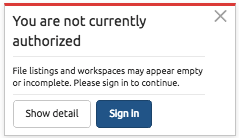

.. figure:: images/white-logo.png
   :alt: SlamData Logo

.. raw:: html

    <embed>
    
    </embed>
    
Troubleshooting FAQ
===================

Section 1 - Configuration
-------------------------

1.1 Configuration File Locations
~~~~~~~~~~~~~~~~~~~~~~~~~~~~~~~~

Upon initial launch, SlamData will not have a configuration file.
However, once a valid database mount has been configured, a file
will be created and used to store mount points.
Unless specified on the command line, SlamData will look for its
configuration file in the following locations by default:

+-------------------------+-------------------------------------------------------------------------------+
| Operating System        | File Location                                                                 |
+=========================+===============================================================================+
| Apple macOS             | /Applications/SlamData Advanced <ver>.app/Contents/java/app/empty-config.json |
+-------------------------+-------------------------------------------------------------------------------+
| Microsoft Windows       | C:\\Program Files (x86)\\slamdata-advanced \<ver\>\\empty-config.json         |
+-------------------------+-------------------------------------------------------------------------------+
| Linux                   | $HOME/slamdata-advanced-<ver>/empty-config.json                               |
+-------------------------+-------------------------------------------------------------------------------+

.. warning:: **Modifying the configuration file**

  If the configuration file needs to be modified by hand, a backup copy should be created
  first. Furthermore, if the file is modified while SlamData is running, any changes may
  be overwritten.

1.1.1 The Metastore
'''''''''''''''''''

Within the configuration file is a section to specify the location and type
of Metastore to use for SlamData.

SlamData relies upon a PostgreSQL or Java H2 database to store metadata. The
metastore saves information such as mount points, views and everything
related to security.

See the Administration Guide for more information.

1.2 Log File Locations
~~~~~~~~~~~~~~~~~~~~~~

SlamData has a single log file whose location depends upon the Operating System.
Replace ``version`` in the table below with the actual version number that you are
running.

+-------------------------+---------------------------------------------------------------------------------+
| Operating System        | File Location                                                                   |
+=========================+=================================================================================+
| Mac OS                  | /Applications/SlamData <version>.app/Contents/java/app/slamdata-<version>.log   |
+-------------------------+---------------------------------------------------------------------------------+
| Microsoft Windows       | C:\Program Files (x86)\slamdata <version>\slamdata-<version>.log                |
+-------------------------+---------------------------------------------------------------------------------+
| Linux (various vendors) | $HOME/slamdata<version>/slamdata-<version>.log                                  |
+-------------------------+---------------------------------------------------------------------------------+

Section 2 - Running SlamData
----------------------------

2.1 SlamData Won't Start
~~~~~~~~~~~~~~~~~~~~~~~~

2.1.1 License Problems
''''''''''''''''''''''

This section is primarily for users experiencing errors when activating
a license. If no errors occur during SlamData start up, and none appear
in the UI then you may skip this section.

SlamData requires a valid license key to start. Users receive a license
key when requesting a trial of SlamData at https://slamdata.com/get-slamdata
or when purchasing SlamData.

When signing up for the trial, a SlamData.com user account is also created.
This user account and password should be remembered as it is needed to
log into SlamData later. (See section 2.1.2 Authentication below) Make sure
to note whether the registered email address contains capitalization anywhere.

An email containing the license key will be sent and the license will be
displayed in-browser after registration is complete. This license will be
entered during installation through the installer or can be entered
manually into the VMOptions file after manual installation is complete.
The location of this file varies based on OS:

+-------------------------+------------------------------------------------------------------+
| Operating System        | File Location                                                    |
+=========================+==================================================================+
| macOS                   | /Applications/SlamData <version>.app/Contents/vmoptions.txt      |
+-------------------------+------------------------------------------------------------------+
| Microsoft Windows       | C:\\Programs Files (x86)\\slamdata <version>\\SlamData.vmoptions |
+-------------------------+------------------------------------------------------------------+
| Linux (various vendors) | $HOME/slamdata<version>/SlamData.vmoptions                       |
+-------------------------+------------------------------------------------------------------+

This file may be located elsewhere if SlamData was installed manually.

The license key is in the form ``ABCDE-FGHIJ-KLMNO-PQRST-UVWXY``.

All license parameters inside of the vmoptions file must be defined even if
they do not contain a value, in which case simply use quotation marks.
The only field that *must* contain a value is the license key as shown below:

::

  -Dlicense_key=ABCDE-FGHIJ-KLMNO-PQRST-UVWXY
  -Dlicense_full_name=""
  -Dlicense_registered_to=""
  -Dlicense_email=""
  -Dlicense_company=""
  -Dlicense_tel_number=""
  -Dlicense_fax_number=""
  -Dlicense_street=""
  -Dlicense_city=""
  -Dlicense_zip=""
  -Dlicense_country=""

If any parameter shown above is not defined then the activation of a license
will fail.

|Invalid-License|

SlamData must be able to validate the license key against a server
located on the public Internet. The http server built into the SlamData
product does not allow configuration of a proxy web server. If your
network utilizes a proxy server for web traffic, this may require
a network administrator to allow the SlamData server to communicate
directly with the license server, sometimes referred to as "punching a hole"
in the firewall.

License Server Information:

::

    IP Address:  97.74.234.176
    Port      :  443

The SlamData server date and time should also be synchronized with
an NTP server. If the date and time are skewed by too much the
license check may fail.

You may also check the following URLs to gather more information which
may assist in troubleshooting the problem:

::

  http://your_host:20223/server/licenseInfo

  http://your_host:20223/server/licensee

2.1.2 Authentication Problems
'''''''''''''''''''''''''''''

|Not-Authorized|

SlamData requires that users authenticate before using it. This
means that the user is proving they are who they say they are. This happens
by providing an email address and a password. This action does not determine
what the user can do, only if the user is valid.

SlamData utilizes an OAuth2 server located on the Internet to do this. Users
will need to authenticate with the exact email address and password used when
registering for the trial. Case sensitivity is important with the email
address and password. If the registered email address and password contained
specific case, it will need to be used here too.

Clicking the "Sign in" icon in the upper right should result in the option
to log into SlamData.com.  If it is not listed as an option this typically
means SlamData is unable to contact the authentication server.

Connectivity between the SlamData server and the public authentication server
should be verified. Again if a proxy server is used on the network then
a network administrator will need to open a route to the authentication
server:

::

    IP Address:  67.207.95.29
    Port      :  443

Once connectivity has been verified SlamData may need to be restarted.

2.1.3 Authorization Problems
'''''''''''''''''''''''''''''

Once a user has authenticated against the authentication server then the
internal SlamData authorization model controls what the user has access to.
Note that a user may successfully log into SlamData but not have any 
authorization permissions to perform actions.

The email address provided by the user during installation is automatically
configured as part of the Admin group in the local SlamData installation.
Members in the Admin group are allowed to perform all actions. If the user
email address does not exactly match what was entered during both during
registration *AND* installation then the user may not be able to perform
any actions.

Check to make sure that the same email address, including proper case,
was used:

  1) During registration
  2) In the UI during installation
  3) When logging in

2.1.4 Less Common Errors
''''''''''''''''''''''''

1. If an older version of SlamData (3.x and older) is installed in a Virtual Machine (VM),
   it may require more than one CPU core before it will launch. If you are
   experiencing problems running an older version of SlamData in a VM, try
   increasing the number of cores and restarting.

2. In older versions of SlamData (3.x and older), an invalid database mount may prevent SlamData
   from starting.  An invalid database mount could be a database that was
   previously available but is no longer available, credentials may have changed, port
   number changed, or any other configuration change that does not allow
   previously validated configurations to successfully connect.

2.2 Accessing SlamData
~~~~~~~~~~~~~~~~~~~~~~

The default SlamData URL is ``http://<servername>:20223``

Example: ``http://localhost:20223``

2.3 How do I see which version I'm running?
~~~~~~~~~~~~~~~~~~~~~~~~~~~~~~~~~~~~~~~~~~~

SlamData's version will be displayed in the browser title bar or
tab title.

The version of the SlamData analytics compiler can be obtained
by browsing to ``http://<servername>:20223/server/info``

Example: ``http://localhost:20223/server/info``

2.4 Running SlamData in the Cloud
~~~~~~~~~~~~~~~~~~~~~~~~~~~~~~~~~

When running SlamData with a hosting provider, such as Amazon EC2, the
most common error encountered is a security policy misconfiguration.
SlamData will need to connect to a data source over the same port as a
standard database client.

A data source or database server and the SlamData server do not
need to run on the same system.

Use the following checklist to ensure network problems are minimized.

1. Verify the security policy for the data source or database server is:

-  Accepting incoming connections from the SlamData server IP address.
-  Accepting incoming connections on the correct port.

2. If you are still unable to connect to your hosted data source or database system:

-  Verify that you can connect with a standard database client from any system.
-  Connect with a standard database client from the same system SlamData is running on.

.. raw:: html

    <embed>
    
    </embed>

