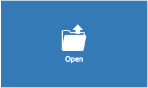
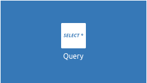
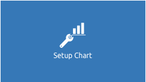
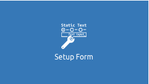
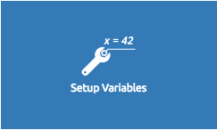
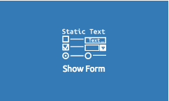
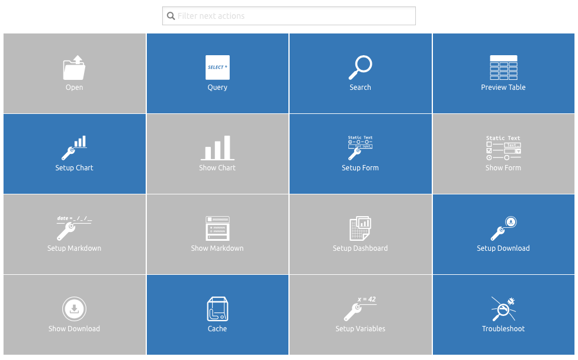

.. figure:: images/white-logo.png
   :alt: SlamData Logo

.. raw:: html

    <embed>
    
    </embed>

User's Guide
============

This User's Guide will assist the user who is unfamiliar with SlamData to
understand the key product features and interface.

For information on how to use SlamData from an administrator's perspective
see the `SlamData Administrator's Guide <administration-guide.html>`__.

For information on how to use SlamData from a developer's perspective
see the `SlamData Developer's Guide <developers-guide.html>`__.

Section 1 - Introduction
------------------------

1.1 Assumptions
~~~~~~~~~~~~~~~

This guide was written with the following assumptions in mind.  The user:

- Has a basic to moderate understanding of JSON or semi-structured data.
- Has appropriate permissions to install the software.
- Has read **and** write access to a data source, such as a database system.

1.2 Requirements
~~~~~~~~~~~~~~~~

For SlamData to run in an optimal environment please see the
`Minimum System Requirements <administration-guide.html#minimum-system-requirements>`__
section.

1.3 Installation
~~~~~~~~~~~~~~~~

Please see the 
`Installation Section <administration-guide.html#section-1-installation>`__
of the Administrator's Guide for installation instructions.

Section 2 - Quick Start
-----------------------

The following two sections will take a new user from no knowledge of the SlamData
workflow to creating a basic Workspace with some suggestions.  This section is intended as a
quick start and not an exhaustive instruction set.  The remaining
sections of the User's Guide contain detailed information on specific
functionality.

2.1 - Configuration Suggestions
~~~~~~~~~~~~~~~~~~~~~~~~~~~~~~~

Modify the **vmoptions** file to adjust the Java memory heap space.  JVM memory
allocation varies by default based upon the JVM vendor and version.  To ensure
correct functionality, reserve 1GB or more of JVM heap space, increasing it
based upon requirements.  It is not uncommon to have more than 4GB of heap space
reserved for SlamData server environments.

Some examples of where the vmoptions file can be found are as follows:

+-------------------------+------------------------------------------------------------------+
| Operating System        | File Location                                                    |
+=========================+==================================================================+
| Mac OS                  | /Applications/SlamData <version>.app/Contents/vmoptions.txt      |
+-------------------------+------------------------------------------------------------------+
| Microsoft Windows       | C:\\Programs Files (x86)\\slamdata <version>\\SlamData.vmoptions |
+-------------------------+------------------------------------------------------------------+
| Linux (various vendors) | $HOME/slamdata<version>/SlamData.vmoptions                       |
+-------------------------+------------------------------------------------------------------+

An example for reserving 4GB of JVM heap space for a server-class system is as follows:

::

    -server
    -Xms4g
    -Xmx4g

The ``-server`` entry, depending on JVM vendor and version, will typically focus on
longer initial load times to allow better compilation methods for faster run-time.  ``-Xms4g``
immediately allocates no less than 4GB of memory and ``-Xmx4g`` allocates no more
than 4GB of memory.

2.2 The Log File
~~~~~~~~~~~~~~~~

If a user suspects that SlamData is not functioning correctly, the first step
to troubleshooting is to look at the most recent log file, located as follows:

+-------------------------+---------------------------------------------------------------------------------+
| Operating System        | File Location                                                                   |
+=========================+=================================================================================+
| Mac OS                  | /Applications/SlamData <version>.app/Contents/java/app/slamdata-<version>.log   |
+-------------------------+---------------------------------------------------------------------------------+
| Microsoft Windows       | C:\\Program Files (x86)\\slamdata <version>\\slamdata-<version>.log             |
+-------------------------+---------------------------------------------------------------------------------+
| Linux (various vendors) | $HOME/slamdata<version>/slamdata-<version>.log                                  |
+-------------------------+---------------------------------------------------------------------------------+

Some JVM errors can cause the JVM to stop running completely, resulting in the SlamData
User Interface (UI) becoming unresponsive. Reviewing the log file should provide helpful information.

2.3 Browsers
~~~~~~~~~~~~

The most compatible browsers with SlamData are always the most recent versions of Google Chrome
and Mozilla Firefox.

Internet Explorer and Safari are both limited in functionality and some UI elements, such as Date picker, do not render properly, or at all.

Section 3 - The Workspace
-------------------------

3.1 Workspace Background
~~~~~~~~~~~~~~~~~~~~~~~~

SlamData approaches analytics workflows with the metaphor of a deck or multiple
decks of cards, sometimes on a Draftboard layout.  A deck is built by stacking
unique cards on top of one another, each card having a specific purpose, such
as opening a table or collection, displaying a result set, displaying a
chart, and so on.

3.2 Mount Data Source
~~~~~~~~~~~~~~~~~~~~~

In this guide the MongoDB database will be used in the examples.

Default MongoDB installations run on port **27017** and have no user authentication
enabled. This guide assumes this configuration in the following instructions.

Click the New Mount icon. |Icon-Mount|

A dialog will appear requesting the name and Mount type.

|Mount-Dialog|

Enter the values below and the dialog will expand.

+------------+-----------+
| Parameter  | Value     |
+============+===========+
| Name       | myserver  |
+------------+-----------+
| Mount Type | MongoDB   |
+------------+-----------+

In the expanded dialog enter the values below and click **Mount**. If a parameter
in the table below has no value, leave that field empty in the interface.

+----------------+-----------+
| Parameter      | Value     |
+================+===========+
| Host           | localhost |
+----------------+-----------+
| Port           |  27017    |
+----------------+-----------+
| Username       |           |
+----------------+-----------+
| Password       |           |
+----------------+-----------+
| Database       |           |
+----------------+-----------+
| Other Settings |           |
+----------------+-----------+

3.3 Creating a Database
~~~~~~~~~~~~~~~~~~~~~~~

* Click on the newly created server named **myserver**. The interface now shows the
  databases that reside within the database system. A new database will need to
  be created to follow along with the guide.

* Click on the Create Folder icon.  |Create-Folder|

  A new folder will appear titled **Untitled Folder**.

* Hover the mouse over **Untitled Folder**.

* Click the **Move / rename** icon that appears to the right.  |Move-Rename|

* Change the name from **Untitled Folder** to ``testdb`` and click **Rename**.

* Click on the newly renamed **testdb** folder.

3.4 Importing Example Data
~~~~~~~~~~~~~~~~~~~~~~~~~~

This guide uses a data set of fictitious patient information that was randomly generated.
The examples in the remaining sections will assume that the patients data set is being used.

A data set with 10,000 documents can be downloaded by following these
instructions:

* Right click `this link <https://github.com/damonLL/tutorial_files/raw/master/patients>`__
  and save the file as ``patients``.  This is a 9 MB JSON file.

* If your operating system named the file something other than
  **patients** you can either rename it or you can rename it
  inside of SlamData once it has been uploaded.

* Ensure the SlamData UI is in ``testdb``, and click
  the Upload icon. |Upload|

* In the file dialog find the patients file and submit it.

As you can see, it is easy to quickly import JSON data into SlamData.
Other formats, such as CSV, can also be quickly imported.

You may wish to index the newly imported patients data set. If
using MongoDB refer to 
`this section <developers-guide.html#indexing-your-database>`__ of
the Developer's Guide to increase search and query performance.

3.5 Exploring Sample Data
~~~~~~~~~~~~~~~~~~~~~~~~~

* Click on **patients** in the user interface.

* A dialog will appear asking the name of the new Workspace being created.

* Give the Workspace a new name and click **Explore**.

* You will be presented with a table showing the contents of the patients data.

Note that the data in the table is not only top level fields but also
contains arrays of various types of data for each record or document.

In this instance SlamData created a new Workspace for you, created an
**Open Card** pointing to the patients data, then stacked a **Preview Table Card**
on top of the **Open Card**.

You can verify this by clicking on the left dots (grippers) on the left side
of the screen and seeing the top most card slide to the right.  The card now
displayed is the **Open Card**.  This determines which table or collection is used
by the cards following it.

* Click on the right grippers to go back to the **Preview Table Card**.

Click on the browse arrows at the bottom to scroll through the pages of data.

Click on the Zoom Out |Zoom-Out| icon in the upper left of the interface to return to
the database view.

3.6 Querying Sample Data
~~~~~~~~~~~~~~~~~~~~~~~~

* Create a new workspace by clicking on the Create Workspace icon. |Create-Workspace|

* Select the **Query Card**.
  
* Replace the provided query text with the query below:
  
.. code-block:: sql

    SELECT
      last_name || ", " || first_name AS Name,
      city as City,
      state as State,
      codes[*].code AS Code,
      codes[*].desc AS Description
    FROM `/myserver/testdb/patients`

Notice that we are concatenating two fields (``last_name`` and ``first_name``),
as well as analyzing each document within the ``codes`` array and fetching
the ``code`` and ``desc`` fields from each of those documents.

* Select **Run Query** in the bottom right.

* Click the right grip.

* Select the **Preview Table Card** to see the results.

* Click the Zoom Out |Zoom-Out| icon to return to the database view.
  
* Optionally rename the **Untitled Workspace** that was created for this workflow.

3.7 Searching Data
~~~~~~~~~~~~~~~~~~

SlamData has several very powerful ways of finding the data you need. In the following
example, you will use the **Search Card**.

* Select the Create Workspace icon. |Create-Workspace|

* Select **Open Card**.
  
* Locate the patients entry in your database and select it.

* Click and drag the right-hand grip and slide it to the left.

The following card types will be presented:

|Card-Choices-1|

Notice how the cards are blue and gray.  The blue cards
are those that can be created directly after the **Open Card**.
Gray cards are those cards that cannot be used following the previous
card.

* Select the **Search Card**.

A new **Search Card** will appear in the UI.  The search string appears
simple but has some very powerful search features.

* Type the word ``Austin`` and either drag the right grip bar
  to the left, or simply click on the right grip bar.

* Select the **Preview Table Card**.

Depending on the performance of your system and database it may take
several seconds before the results are displayed.  Keep in mind that
SlamData is searching the patients collection that we imported into
the database system, and that indexes can significantly boost performance
for searches.

Once the results appear, you can browse them just like you did earlier
in the **Preview Table Card** with the controls in the bottom left of the
interface.

Did you notice that in the search string earlier we did not specify
which field we wanted to search?  That is part of the power of SlamData.
Relatively non-technical users can use SlamData to search all of
their data sources with little (or even no) knowledge in advance of the data
stored within.

Of course when searching all available fields for the search string
it is going to take longer than if we were to explicitly define which field.
Let's go back to the search card by dragging the current card
to the right again, or single-click on the left grip.

Let's search for any patients currently living in the city of Dallas.

* Type the string ``city:Dallas`` and either drag the right grip bar
  to the left, or simply click on the right grip bar.

* View the results in the **Preview Table Card** again.

The results should have appeared much faster than the previous search
because we told SlamData to only look at the **city** field.

We can also search on non-string values such as numbers.  Let's find
all of the patients who are between the ages of 45 and 50:

* Go back to the **Search Card**.

* Enter the string ``age:>=45 age:<=50``.

* View the results in the **Preview Table Card** again.

As one last example let's see how we can mix and match different types.
We want to know how many males over the age of 50 used to live in California.

* Go back to the **Search Card**.

* Enter the string ``previous_addresses:"[*]":state:CA age:>50 gender:=male``.

* View the results.

3.8 - Downloading Data
~~~~~~~~~~~~~~~~~~~~~~

This workspace can be adjusted to allow a user to download the results of the
search after the search is complete.

* Click the right gripper to stack a new card on top of the **Preview Table Card**.

* Select **Setup Download**.

* Select either ``C;S;V`` (CSV) or ``{JS}`` (JSON) format for the download.

* Click the right gripper to stack a new card on the deck.

* Select **Show Download**.

* Select the **Download button** to download the data.

You have now entered search criteria, browsed the results and downloaded
the results in a CSV or JSON format.

Section 4 - Cards
-----------------

4.1 Introduction to Cards
~~~~~~~~~~~~~~~~~~~~~~~~~

Cards each have a distinct purpose and typically provide a single, unique action
that can often be combined with the cards before and after it to create a workflow.
This section describes the types of cards and the purpose of each. The cards are
described in alphabetical order.

4.2 - Cache Card
~~~~~~~~~~~~~~~~

|Cache-Card|

Description
@@@@@@@@@@@

The **Cache Card** will store results, for example from a **Query Card** or a **Search
Card**, for faster retrieval while typically reducing database system load.

Behavior
@@@@@@@@

The **Cache Card** requires a location to store its results.  When a newly selected
**Cache Card** becomes active, the user is presented with a text field and a **Confirm**
button.  The value of the text field can be edited directly
to change the location of the cached information. The credentials provided to
mount the original data source must have read and write privileges to the specified path
or the **Cache Card** will not be created.

Results stored in a **Cache Card** are updated when one of the following occurs:

* The table or collection in the **Open Card** is modified.
* The query in the **Query Card** is modified.
* The search parameters in the **Search Card** are modified.

4.3 - Open Card
~~~~~~~~~~~~~~~

|Open-Card|

Description
@@@@@@@@@@@

The **Open Card** can be used, for example, to specify a collection from which
subsequent cards will operate from.

Behavior
@@@@@@@@

The **Open Card** is typically the first card in a workflow if a query
is not used as the source for subsequent cards.  By selecting a collection
with the **Open Card**, the next card will have access to that collection
as a whole.

Common scenarios for using the **Open Card** include following it with
a **Search Card** or a **Preview Table Card**.

4.4 - Preview Table Card
~~~~~~~~~~~~~~~~~~~~~~~~

|Preview-Table-Card|

Description
@@@@@@@@@@@

The **Preview Table Card** provides a tabular view of data from a data source. It is
particularly useful for data exploration and for presenting the results of a
**Query Card** or a **Search Card**.

Behavior
@@@@@@@@

When working with a data source, it is very useful to visualize data in a tabular format.
The **Preview Table Card** provides a very convenient way to present data that is the
result of a user action, such as a **Query Card**. Controls are available in the lower-left
that allow the user to scroll through the result set.

4.5 - Query Card
~~~~~~~~~~~~~~~~

|Query-Card|

Description
@@@@@@@@@@@

The **Query Card** is used, for example, to execute an SQL² query against one or
more collections.  If variables were defined from either
a **Setup Variables Card** or a **Setup Markdown Card** in previous cards then
those variables may be used in the query.  For more information
on the SQL² syntax please see the
`SQL² Reference Guide <sql-squared-reference.html>`__.

Behavior
@@@@@@@@

If a **Query Card** follows a **Preview Table Card** then the collection name
will be automatically populated in the query and cannot be changed.

A **Query Card** contains a ``Run Query`` button. This button is used after
the query has been entered. If a query has not changed, the query will
automatically execute within a workflow.

4.6 - Search Card
~~~~~~~~~~~~~~~~~

|Search-Card|

Description
@@@@@@@@@@@

The **Search Card** searches for entries from a data source.
A data source can either be a specific collection or table designated
by an **Open Card** or it can also be the result set from a **Query Card**.

Behavior
@@@@@@@@

A **Search Card** is typically followed by a **Preview Table Card** to display
the results of a search.

Values not preceded by a field name and
colon, such as ``fieldName:``, will cause the data source to search through
all fields and may cause a delay in producing results from large tables
or collections.  Additionally, specifying a field name before a value will
typically result in a data source using an indexed query (if an appropriate
index exists), resulting in a faster response.

Search parameters are "AND"ed together, so the more parameters that are
provided, the more selective the result will be. The following table shows
some common search examples:

+---------------------------+---------------------------------------------------------------+
| Example                   | Description                                                   |
+===========================+===============================================================+
| ``foo``, ``+foo``         | Searches for the **substring** ``foo`` in **all fields**.     |
+---------------------------+---------------------------------------------------------------+
| ``-foo``                  | Searches for everything **not** containing the text ``foo``.  |
+---------------------------+---------------------------------------------------------------+
| ``=foo``                  | Searches for the **full word** ``foo`` in **all fields**.     |
+---------------------------+---------------------------------------------------------------+
| ``foo:=50``               | Searches the field ``foo`` for a value of 50.                 |
+---------------------------+---------------------------------------------------------------+
| ``foo:>=50``              | Searches the field ``foo`` for any value greater than or      |
|                           | equal to 50.                                                  |
+---------------------------+---------------------------------------------------------------+
| ``foo:50..60``            | Searches the field ``foo`` for values inside the range 50 to  |
|                           | 60, inclusive.                                                |
+---------------------------+---------------------------------------------------------------+
| ``foo:bar:baz``           | Searches for everything that contains a ``foo`` field which   |
|                           | contains a ``bar`` field which contains the text ``baz``.     |
+---------------------------+---------------------------------------------------------------+
| ``foo:"[*]":bar:baz``     | Performs a deep search through the ``foo`` array and          |
|                           | examines each subdocument's ``bar`` field for the             |
|                           | **substring** ``baz``.                                        |
+---------------------------+---------------------------------------------------------------+

4.7 - Setup Chart Card
~~~~~~~~~~~~~~~~~~~~~~

|Setup-Chart-Card|

Description
@@@@@@@@@@@

The **Setup Chart Card** is required before using the **Show Chart Card**.  This
card is used to specify the chart type and chart options of the subsequent
**Show Chart Card**. Major chart types include the following:

* Area Chart
* Bar Chart
* Line Chart
* Pie Chart
* Radar Chart
* Scatter Plot Chart

Behavior
@@@@@@@@

Each major chart type will have options that allow control over
the look of the chart.  For example, an **Area Chart** will
provide the option to stack values.

4.8 - Setup Dashboard Card
~~~~~~~~~~~~~~~~~~~~~~~~~~

|Setup-Dashboard-Card|

Description
@@@@@@@@@@@

The **Setup Dashboard Card** may only be selected as the first card in the
first deck inside of a workspace.  Creating a **Setup Dashboard Card** is
similar to flipping a workspace that contains a single deck and
choosing **Wrap**, except there is no existing deck and one must now
be created.

Behavior
@@@@@@@@

Because the **Setup Dashboard Card** creates a workspace with no decks or
cards, it must be the first card in the deck.  Additionally, a user
must now create a new deck inside of this Dashboard.

4.9 - Setup Download Card
~~~~~~~~~~~~~~~~~~~~~~~~~

|Setup-Download-Card|

Description
@@@@@@@@@@@

The **Setup Download Card** precedes the **Show Download Card**.  The format
of the download file can be configured to either CSV or JSON. Additionally,
several other parameters can also be configured.

Behavior
@@@@@@@@

The **Setup Download Card** must always precede a **Show Download Card**.  Each
file format (CSV/JSON) will have different export options available.  Once
options are configured, they can be changed by the workspace author, but not
by a user through a published or embedded workspace.

4.10 - Setup Form Card
~~~~~~~~~~~~~~~~~~~~~~

|Setup-Form-Card|

Description
@@@@@@@@@@@

The **Setup Form Card** provides a graphical method to select fields to display from a data set.

Behavior
@@@@@@@@

The **Setup Form Card** provides a wide-range of UI elements to choose from. After a UI element has been chosen, then the field to display is selected.
An example workflow would be to select an **Open Card** and point it at a database collection, then follow it with a **Setup Form card**.
The field in the **Setup Form Card** can subsequently be used in other cards, such as a **Query Card**.
This provides an alternative to using the **Setup Markdown Card**, defining variables, and so on.

4.11 - Setup Markdown Card
~~~~~~~~~~~~~~~~~~~~~~~~~~

|Setup-Markdown-Card|

Description
@@@@@@@@@@@

The **Setup Markdown Card** allows a user to write the Markdown code that
will be rendered within a **Show Markdown Card**.

Behavior
@@@@@@@@

The **Setup Markdown Card** acts like a text editor to edit Markdown.  Valid
Markdown code will typically be highlighted blue and line numbers are
listed in the left column.

For detailed information regarding SlamDown,
the SlamData-enhanced version of Markdown, please see the
`SlamDown Reference Guide <slamdown-reference.html>`__.  The reference
guide describes how to create interactive UI elements such as drop
downs, radio boxes, check boxes, and more.

4.12 - Setup Variables Card
~~~~~~~~~~~~~~~~~~~~~~~~~~~

|Setup-Variables-Card|

Description
@@@@@@@@@@@

The **Setup Variables Card** allows a user to create a workspace where the
results are controlled by parameters that are programatically passed into it.

Behavior
@@@@@@@@

Each variable in the **Setup Variables Card** is defined on a separate line.  A
variable may be any data type listed in the **Data Types** section below.

Note that a **Setup Variables Card** followed by a **Troubleshoot Card** is helpful in
validating values passed into the Workspace.

When embedding a Workspace that contains a **Setup Variables Card** into a third party
application, the JavaScript and HTML that SlamData generates for a user
will be slightly different than workspaces without a **Setup Variables Card**.
For example, if two variables called ``state`` and ``city`` with values of
``CO`` and ``DENVER``, respectively, are defined in a variables card, the
resulting JavaScript will contain a ``vars`` section, similar to the following:

.. code-block:: javascript

      SlamData.embed({
        deckPath: "/server/db/collection/MyWorkspace.slam/",
        deckId: "deckid...abc...123...",
        // An array of custom stylesheets URLs can be provided here
        stylesheets: [],
        // The variables for the deck(s), you can change their values here:
        vars: {
          "deckid...abc...123...": {
            "state": "CO",
            "city": "DENVER"
          }
        }
      });

Third party applications may generate this JavaScript programatically, changing
the values of the ``state`` and ``city`` variables based upon custom logic.

Data Types
@@@@@@@@@@

Text
!!!!

An input field will appear when **Text** is chosen.  Alphanumeric
text may be entered.

Example: ``My 123 value here``

DateTime
!!!!!!!!

A date and time picker will appear when **DateTime** is chosen.  Selecting a
date and time will designate the default value.

Date
!!!!

A date picker will appear when **Date** is chosen.  Selecting a
date will designate the default value.

Time
!!!!

A time picker will appear when **Time** is chosen.  Selecting a time
will designate the default value.

Interval
!!!!!!!!

An input field will appear when **Interval** is selected. Selecting
an interval will designate the default value. Interval is defined
using the ISO 8601 format.

Example: ``PT12H34M``

In the above example, ``P`` is the duration, ``T`` is the time designator,
``12H`` is 12 hours and ``34M`` is 34 minutes.

Boolean
!!!!!!!

A checkbox will appear when **Boolean** is chosen.  Checking
the box will designate the default value to ``true``.

Numeric
!!!!!!!

An input field will appear when **Numeric** is chosen.  Only
numeric values are allowed in this field.

Example:  ``1`` or ``1.5``

Object ID
!!!!!!!!!

An input field will appear when **Object ID** is chosen.  Any
valid Object ID can be entered here.  The subsequent query should not
be preceded by the ``OID`` function in SQL² as this will be handled
automatically.  For instance, if the value ``5792b247045175200c4fcd0f``
is entered for the ``myoidvar`` variable, the resulting query would
look similar to the following:

.. code-block:: SQL

    SELECT *
    FROM `/server/db/collection`
    WHERE _id = :myoidvar

Array
!!!!!

An input field will appear when **Array** is chosen.  A valid array
should be entered as the default.

Example:  ``["S1", "S2", "S3"]``

The subsequent query should reference the values in the array appropriately.
For example, if the variable ``sensors`` was defined in the **Setup
Variables Card**, and the user wanted a query to return all records containing
a ``sensors`` field that matched any entry from the array, the query could
look similar to the following:

.. code-block:: SQL

    SELECT *
    FROM `/server/db/collection`
    WHERE sensor IN :sensors

Object
!!!!!!

An input field will appear when **Object** is chosen. Object is a JSON object.

Example: ``{ "a": 1 }``

SQL² Expression
!!!!!!!!!!!!!!!

An input field will appear when **SQL² Expression** is chosen. A valid
SQL² Expression should be entered as the default.

Example:

.. code-block:: SQL

    SELECT *
    FROM `/server/db/collection`

SQL² Identifier
!!!!!!!!!!!!!!!

An input field will appear when **SQL² Identifier** is chosen.
A valid query path should be entered as the default.  This allows a user
to pass in a specific query path while the remainder of the query remains
unchanged.

Example: mypath = ``/server/db/collection``

The subsequent query would look similar to the following:

.. code-block:: SQL

    SELECT *
    FROM :mypath

4.13 - Show Chart Card
~~~~~~~~~~~~~~~~~~~~~~

|Show-Chart-Card|

Description
@@@@@@@@@@@

The **Show Chart Card** follows the **Setup Chart Card**. Once the options
have been selected in the **Setup Chart Card** and a chart is ready to be rendered,
the **Show Chart Card** should be selected.

Behavior
@@@@@@@@

The **Show Chart Card** renders the chart created using the **Setup Chart Card**.

4.14 - Show Download Card
~~~~~~~~~~~~~~~~~~~~~~~~~

|Show-Download-Card|

Description
@@@@@@@@@@@

The **Show Download Card** follows the **Setup Download Card**.

Behavior
@@@@@@@@

The **Show Download Card** provides a button to download data using the format and options
selected using the **Setup Download Card**.

4.15 Show Form Card
~~~~~~~~~~~~~~~~~~~

|Show-Form-Card|

Description
@@@@@@@@@@@

Behavior
@@@@@@@@

4.16 - Show Markdown Card
~~~~~~~~~~~~~~~~~~~~~~~~~

|Show-Markdown-Card|

Description
@@@@@@@@@@@

The **Show Markdown Card** follows the **Setup Markdown Card**. Once the options
have been selected in the **Setup Markdown Card** and the Markdown is ready to be rendered,
the **Show Markdown Card** should be selected.

Behavior
@@@@@@@@

The **Show Markdown Card** renders the Markdown created using the **Setup Markdown Card**.

4.17 - Troubleshoot Card
~~~~~~~~~~~~~~~~~~~~~~~~

|Troubleshoot-Card|

Description
@@@@@@@@@@@

The **Troubleshoot Card** is a useful tool to help find problem or issues in a Workspace.

Behavior
@@@@@@@@

The **Troubleshoot Card** is helpful in validating values passed into a Workspace. For example,
a **Setup Variables Card** followed by a **Troubleshoot Card** would enable variable values to be checked.

.. |Icon-Mount| image:: images/SD4/icon-mount.png

.. |Zoom-Out| image:: images/SD4/icon-zoom-out.png

.. |Icon-Flip| image:: images/SD4/icon-flip.png

.. |Mount-Dialog| image:: images/SD4/screenshots/mount-dialog.png

.. |Create-Folder| image:: images/SD4/icon-create-folder.png

.. |Move-Rename| image:: images/SD4/icon-move-rename.png

.. |Upload| image:: images/SD4/icon-upload.png

.. |Create-Workspace| image:: images/SD4/icon-create-workspace.png

